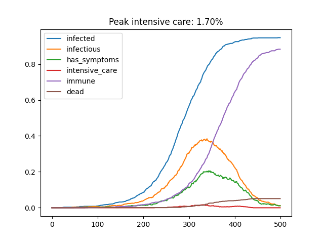
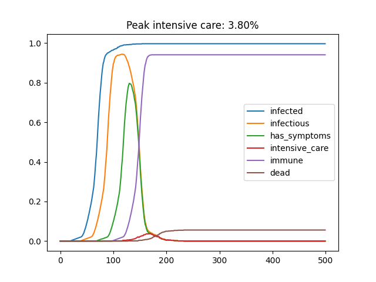

# Abstract

Covid-19 is around. In order to limit the damage, countries all over the world are restricting public life.  

This is how we are told today to behave - because we ignore who is vulnerable and who probably not:

| meeting situation | vulnerable    | non-vulnerable  |
|-----------------|:-------------:|:---------------:|
| **vulnerable**      | keep distance | keep distance   |
| **non-vulnerable**  | keep distance | keep distance   |

Imagine we could behave **like this** instead:

| meeting situation | vulnerable    | non-vulnerable  |
|-----------------|:-------------:|:---------------:|
| **vulnerable**      | keep distance | keep distance   |
| **non-vulnerable**  | keep distance | **hug and kiss**    |

I wanted to find out how this would change something; below is my story and the resulting model.

# The Problem
The current Covid-19 pandemic is one of the biggest challenges the world has seen during the last century. 
We see that governments react to this with a number of quite drastic measures.
Most of these measures have dramatic side effects with strong impact on the economy. 
Some country bring their economy basically to a halt.
 
We must be aware of the consequences:
A depression will lead to a bigger share of poor people.
And it is well known that the life expectancy of poor people is far (5 to 10 years) below that of the average of the population.
In other words, this will cost lifes.

**So we must be careful that the measures taken and the side effects resulting from those do not outweigh the direct damage done by the pandemic.**   

The way the society currently is acting in kind of reminds me of _The Pursuit of Unhappiness_ by Paul Watzlawick. 
In that book, he describes the pattern "more of the same".
This is what we are doing right now:
More restrictions, more closed borders, more closed business, ...  
All this will lead to dead people as well; they will just not make it onto the tv screens in the same way as the direct Covid-19 victims. 
And of course, politicians are afraid of ugly pictures on tv screens as a consequence of their decisions.  

# The hypothesis
My thought was that there must be an alternative to the "more of the same" approach.
So far we don't know if individuals who had the disease actually get immune, and for how long.
However, this is very likely.
So let's assume this for now.
 
Hence, an alternative approach to isolating the whole population would be to isolate the vulnerable part of the population while trying to establish herd immunity as quickly as possible among the rest.
As I write this, both the UK and the Netherlands are heading down this path.
Also Sweden where I live seems to follow this approach to some extent. 
The problem with this might be the peaking of the load on the health system: 
There might simply not be enough capacity to help all the patients that get seriously sick as a consequence of a Covid-19 infection.

I realized that we currently are throwing away some information.
Now my **idea** is following: Can we utilize the information that we have to improve the "behaviour of the system"?
So what knowledge do we actually throw away in our current behaviour?
When you meet another person, you cannot tell:
Does this person belong to the vulnerable group or not?
Maybe this person is already immune?
Maybe this person sees herself as non-vulnerable and knows that she is normally not in contact with any vulnerable persons?     

So if we would be able to adjust how we approach each other based on that knowledge, would that change the behaviour of the system?
Would that enable us to find a good trade-off between shuttng down whole countries and protecting the vulnerable individuals?

So here is the hypothesis:
Assume we make the non-vulnerable group visible in public.
E.g. remember the green ribbons you can wear at a discotheque to signal your environment that you're "free".
The rules could be as follows:
* When two non-vulnerable persons meet:
"Hug and kiss" to ensure that you transfer the infection if any of you is infectious. 
* Else: Keep away from each other

In order to check the hypothesis I have written a small simulation model that compares this scenario to the current ("default") one.     

# A Model to Compare Scenarios

## General
The model is written in Python. I'm a physicist which explains the coding style ;-)
20 years back I was pretty much in computational physics, in particular Monte Carlo (MC) modeling, 
and that is the approach I have chosen here as well.

There is a `requirements.txt` file that you can use with `pip` to prepare a virtual environment.

I tried to keep it as simple as possible.
One nice thing about MC models of that type is that you can easily extend them if needed. 

Basically, I create a `population` that consists of _n_ `individual`s with a number of properties. 
The simulation itself is initialized and runs for a certain number of time steps.

There are a number of global variables (...) defined that characterize the simulation.
These can become a `simulation` class later on.  

I use `matplotlib.pyplot` for the visualization, but this is optional.

## Class for Individuals

The constructor takes one argument, which is the `weakness` of the individual.
If this weakness is lower than a predefined threshold, the individual is considered to be vulnerable.
This allows for a initialization of the individual with a random number so that a certain fraction of the population becomes vulnerable. 
 
The class has two further methods: `age()` and `infect()`.
Once infected, an individual will go through different phases: 
* infected
* infectious
* has symptoms
* immune (i.e. healthy and no longer infectious)
This happens during ageing by increasing the infected value by one in each time step,
and changing the other properties depending on the global variables for the simulation.

## Class for Population

The constructor takes one argument, which is the `size` of the population, 
and creates a list of individuals.

The `age()` method simply ages the list of individuals.

The `meet()` method simulates a meeting of two random sub-groups of the population. I know, very dirty. 
They meet in pairs and try to infect each other.

The `try_infect()` method contains the logic of the model, basically what is shown in the table in the abstract.
There is a transmission likelyhood for meetings between non-vulnerable individuals
(as they are expected to hug and kiss, it is typically high, say 1), and another one for all other meetings. 

Finally, the `statistics()` methods returns a list of statistics for the current state of population.
What would you get if you could test the population of your country several times each day?   
When calculating the fraction of individuals needing intensive care,
it is assumed that every vulnerable individual needs intensive care once the individual has symptoms.   

# Results

Below an example for how the results look like for the reference scenario (keep distance between all). Time steps are arbitrary units. 


This is what was simulated:
```python
"fraction of the population that is considered vulnerable"
vulnerable_fraction = 0.05

"time steps after infection"
"- before showing symptoms"
symptom_age = 50
"- before being infectious"
infectious_age = 20
"- before being immune and no longer infectious"
immune_age = 80

"transmission likelihood during meeting"
"- involving vulnerable individual"
transmission_likelyhood_1 = 0.05
"- between non-vulnerable individuals"
transmission_likelyhood_2 = 0.05

"size of population"
size_of_population = 1000
"pairs of people meeting in each time step"
fraction_of_pairs = 0.5
number_of_pairs = int(size_of_population*fraction_of_pairs)

"number of time steps to simulate"
number_of_steps = 500
```


Below an example for the results when assuming 100% transmission of the disease between the non-vulnerable individuals. 


This is what was simulated:
```python
"fraction of the population that is considered vulnerable"
vulnerable_fraction = 0.05

"time steps after infection"
"- before showing symptoms"
symptom_age = 50
"- before being infectious"
infectious_age = 20
"- before being immune and no longer infectious"
immune_age = 80

"transmission likelihood during meeting"
"- involving vulnerable individual"
transmission_likelyhood_1 = 0.05
"- between non-vulnerable individuals"
transmission_likelyhood_2 = 1

"size of population"
size_of_population = 1000
"pairs of people meeting in each time step"
fraction_of_pairs = 0.5
number_of_pairs = int(size_of_population*fraction_of_pairs)

"number of time steps to simulate"
number_of_steps = 500
```

# Summary
